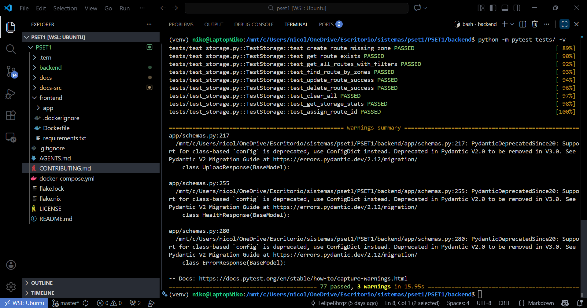
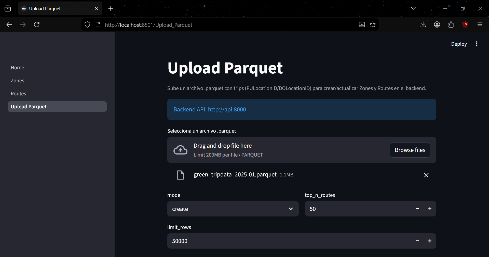
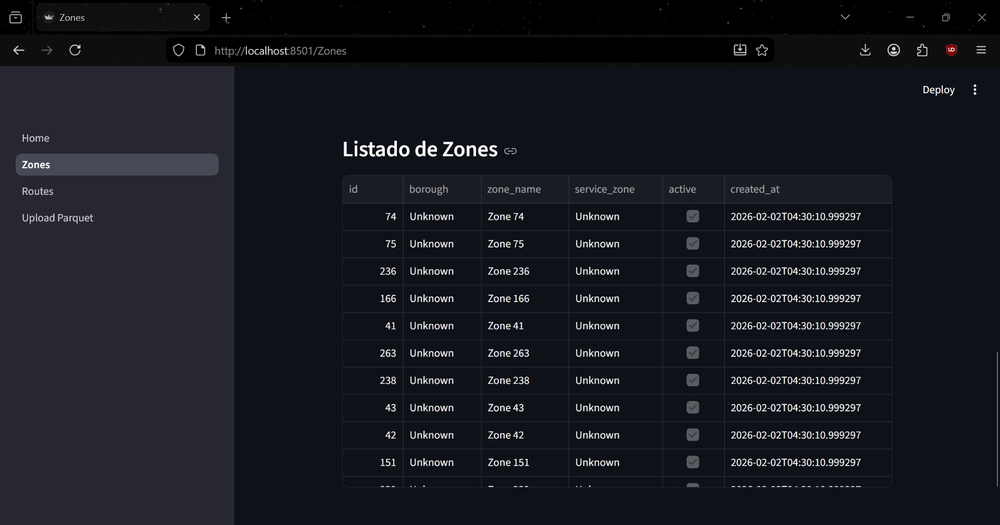

# Evidence & Proof of Functionality

## Docker Build Success

```bash
COMPOSE_DOCKER_CLI_BUILD=1 DOCKER_BUILDKIT=1 docker compose up --build
```


## Test Suite Results

```bash
cd backend
source venv/bin/activate
python -m pytest tests/ -v
```


## Parquet Functionality



